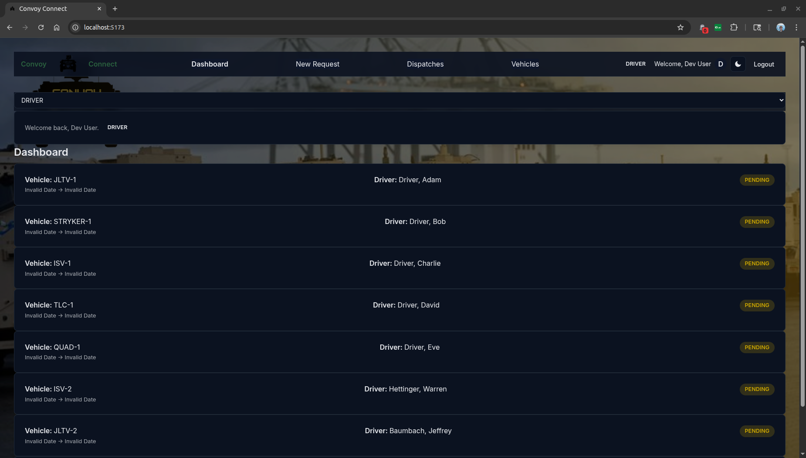
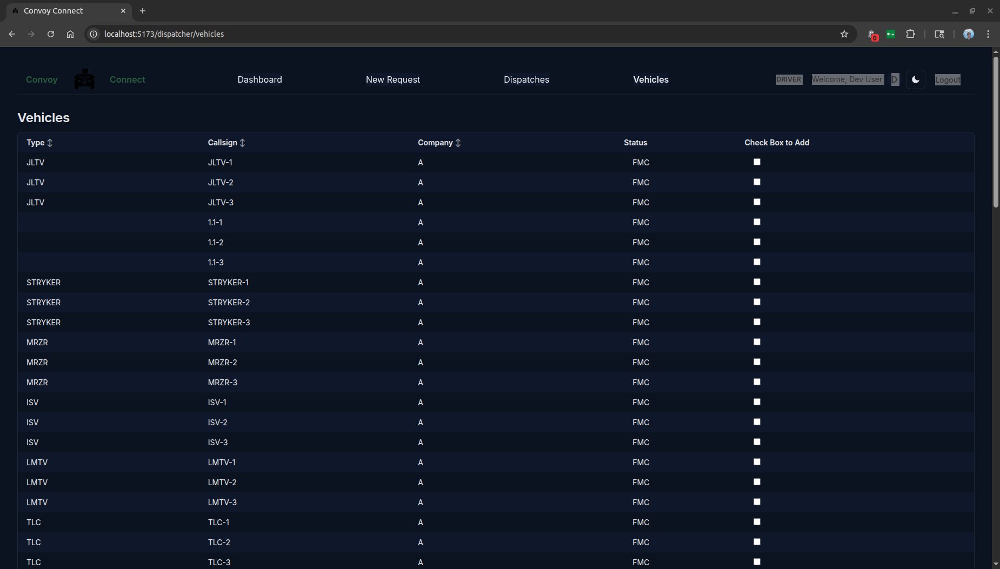
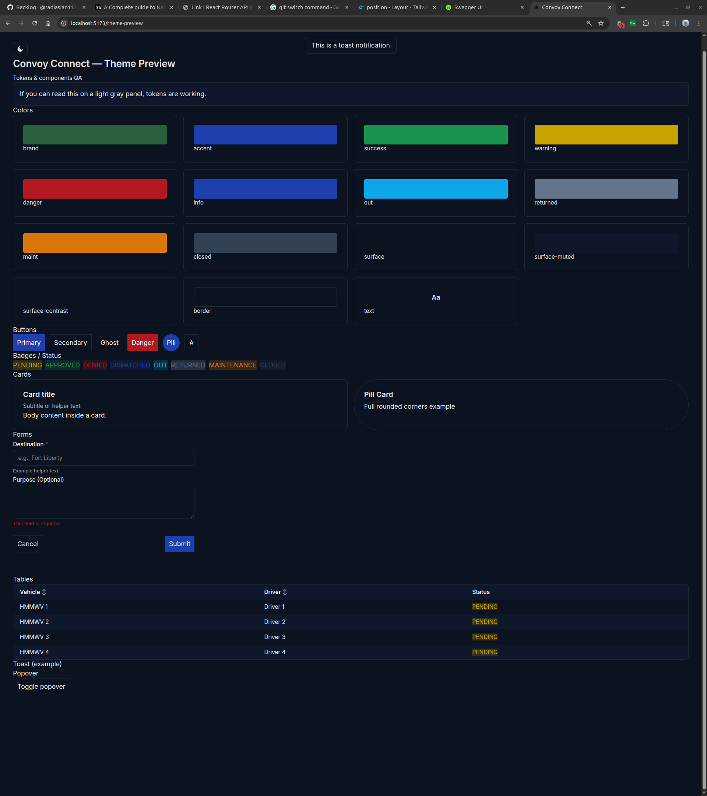

# Frontend (Convoy Connect)

A Vite + React single-page application for managing convoy dispatches across three roles: DRIVER, APPROVER, and DISPATCHER. This document explains the UX/flows, project structure, and conventions to onboard new developers quickly.

## Quick Start

- Requirements: Node 18+ and npm 9+ recommended.
- Install: `cd Frontend && npm install`
- Env: create `Frontend/.env.local` with

```
VITE_API_URL=http://localhost:8080
# Use `cookie` only if backend sets and expects cookies
VITE_AUTH_MODE=none
```

- Run dev: `npm run dev`
- Open: http://localhost:5173

Backend should be running on `VITE_API_URL`. In dev, the app seeds a local user with all roles and supports a dev-only role switcher.

## User Experience and Flows

### Global Navigation

- Sticky top Navbar spans the full width. Left: brand + centered nav links. Right group (right → left visual order): Logout, Theme toggle, User icon, Welcome message, Role badge.
- Theme toggle switches light/dark.
- Role badge shows the active role used for page gating and UI.

### Landing: Dashboard

- Default landing after login.
- Background slideshow cycles images (`/public/media/1.png`–`5.png`) with a soft cross-fade and dim overlay.
- In dev, a small card shows a welcome message and the active role for quick UI checks. A Dev Role Switcher is available where indicated.

### Screenshots

Below are example visuals to align UI expectations (assets are in `Frontend/public/media`).






### Theme Preview (Styling Guidance)

- Style Guide: Frontend/src/styles/StyleSheet.md
- 
- Route: `/theme-preview` (dev only)
- Shows color tokens, buttons, badges, cards, forms, tables, toasts, and a popover demo.
- Color swatches are bound to CSS variables (e.g., `--color-brand`, `--color-surface-muted`) for accurate light/dark validation.
- Use this page to verify component styles as you iterate on CSS tokens in `styles/theme.css` and primitives in `styles/components.css`.

### Driver Flow

- New Request (`/driver/new-request`)
  - PMCS image as page background.
  - Vehicle picker lists available FMC vehicles; add multiple vehicles.
  - For each selected vehicle, pick an eligible driver (qualified, not busy, not already selected).
  - Validations: destination, start/end times, at least one vehicle and driver.
  - Submits one dispatch per selected vehicle.
  - UI uses anchored popover-based selects for consistent, on-screen dropdown positioning.

### Approver Flow

- Approvals (`/approver/approvals`)
  - Pending requests list with vehicle and requester info.
  - Driver qualification popover shows the driver’s qual types derived from vehicles and recorded quals.

### Dispatcher Flow

- Dispatches (`/dispatcher/dispatches`)
  - Filter chips for OUT, DISPATCHED, RETURNED.
  - Cards show destination, time range, purpose, and status.

- Vehicles (`/dispatcher/vehicles`)
  - Inventory management view (when available on backend).

## Architecture

```
Frontend/src
├─ api/            # Axios client and mappers
├─ components/     # Reusable UI (Navbar, Popover, SelectPopover, Toasts, etc.)
├─ context/        # Global contexts (Auth)
├─ data/           # Pure selectors/business logic
├─ hooks/          # useFetch, domain data hooks
├─ pages/          # Route-level screens
├─ styles/         # Global CSS
└─ App/router.jsx  # Routes and role gating
```

### State and Data Fetching

- `AuthContext` provides `user`, `loading`, `login`, `logout`. In dev, a local user is created and `DevRoleSwitcher` can change the active role.
- `useFetch(fn, deps, { auto })` handles async fetching with abort and loading/error state.
- Domain hooks in `hooks/useDomainData.js` wrap API calls and derive common sets like busy drivers.
- Business logic lives in `data/selectors.js` (e.g., `getEligibleDrivers`, `getBusyDriverIds`, `getDriverQualTypes`). Keep selectors pure and testable.

### HTTP Client

- `api/client.js` centralizes axios config and API calls.
- Base URL: `VITE_API_URL`.
- Auth: if `VITE_AUTH_MODE=cookie`, axios sends credentials; otherwise it does not.
- Includes request “shims” (`createRequest`, `listRequests`) that map to dispatch endpoints for compatibility.

### UI Building Blocks

- `Navbar`: sticky top bar with brand, centered routes, and the right-side user/controls group.
- `BackgroundSlideshow`: fixed, cross-fading background images with non-blocking pointer events.
- `BackgroundMedia`: helper for video/image backgrounds on specific pages.
- `SelectPopover` + `Popover`: anchored, viewport-aware dropdowns used for consistent selects (vehicle, driver, dev role).
- `ToastProvider`: simple toast notifications (`showToast(message, type)`).
- `EmptyState`, `SkeletonList`, `StatusBadge`: common primitives.

### Routing and Role Gating

- `App/router.jsx` defines routes and wraps protected pages in `ProtectedRoute`.
- Role arrays gate access (e.g., `["DRIVER"]`). In dev, the seeded user has all roles; the active role still controls gates.

## Conventions

- Prefer selectors for business rules, not inside components.
- Prefer domain hooks for data access and derive sets/memoized values.
- Use `SelectPopover` for dropdowns needing consistent positioning instead of native `<select>` where UX matters.
- Keep components focused and composable; avoid coupling to API shapes (map data in `api/mappers.js`).

## Common Tasks

- Add a new page:
  1. Create `pages/MyPage.jsx`.
  2. Add a route in `App/router.jsx` (wrap with `ProtectedRoute` as needed).
  3. Link it in `Navbar` if it’s top-level.

- Add a dropdown:
  Use `SelectPopover`:

  ```jsx
  <SelectPopover
    value={value}
    onChange={setValue}
    options={[{ value: "A", label: "Alpha" }]}
    placeholder="Select…"
    buttonClassName="btn btn-secondary"
  />
  ```

- Show a toast:
  ```jsx
  const { showToast } = useContext(ToastCtx);
  showToast("Saved", "success");
  ```

## Dev-Only Utilities

- `ThemePreview` at `/theme-preview` (dev only) to view tokens/components.
- `DevRoleSwitcher` renders only in dev; toggles active role used for UI/gates.

## Testing Notes

- This repo does not include frontend tests. For new logic, consider colocated tests for selectors or hooks.
- When adding tests, prefer pure selector tests over component tests.

## Troubleshooting

- Navbar not clickable: ensure background layers use `pointer-events: none` or have lower `z-index`.
- 401s in dev: Auth is mocked in dev; verify you didn’t set `VITE_AUTH_MODE=cookie` without a cookie-based backend.
